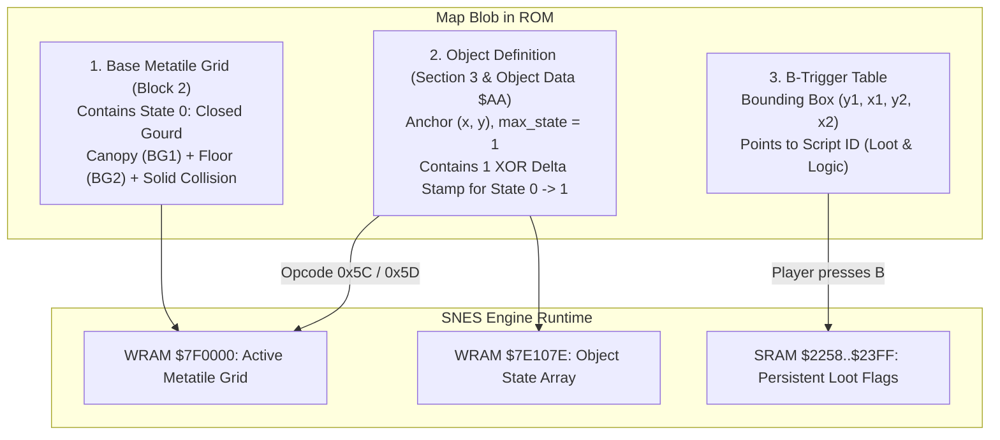

# How Gourds and Map Objects Work in Secret of Evermore

This guide explains the architecture of loot gourds, chests, and interactive map objects in *Secret of Evermore*, based on reverse-engineering of the ROM blob formats, bytecode opcodes, and SNES engine runtime routines.

---

## 1. Executive Summary & Core Answers

### Q1: What tiles do we have to draw on the map? (lid open/closed, empty map)
* **Draw State 0: Closed gourd (with lid on) directly on the base map.**
* In the SNES engine pipeline, the room's decompressed 2D metatile grid (Block 2 / WRAM `$7F0000`) is the **default baseline appearance (State 0)**.
* You do **not** draw an "empty map" or a hollow hole. The base map already contains the closed gourd with its canopy tiles (Layer 1), terrain/floor tiles (Layer 2), and solid collision attributes (`slice 2`).

### Q2: How many metatile versions live in the objects section of the blob?
* **Exactly ONE delta stamp per transition** (so for a standard 2-state gourd, **only 1 delta stamp** exists in the blob).
* Section 3 does **not** store full duplicate metatiles or whole 2×2 images for both states.
* It stores an **XOR delta record**: a footprint (`tw × th`), an 8-bit stream mask byte, and 16-bit XOR words for only the tiles that change.
* State 0 has no record in the object block — it is defined solely by the base map.

### Q3: How do they map to states 0 and 1?
* **State 0 (Closed / Unlooted):**
  * Metatile Grid = Base decompressed Block 2 grid (no deltas applied).
  * WRAM Object State `$7E107E + obj_id` = `0`.
  * Visual = Closed gourd with lid.
  * Collision = Impassable/solid (`$901F` in Room `0x34`).
* **State 1 (Open / Looted / Unloaded):**
  * Metatile Grid = Base grid **XORed** with the object's transition delta stamp (`grid[y][x] ^= delta`).
  * WRAM Object State `$7E107E + obj_id` = `1` (or `0x7E` / `0x7F` when unloaded).
  * Visual = Open gourd (lid removed, dark inner opening).
  * Because XOR is an involution ($A \oplus B = C \implies C \oplus B = A$), applying the delta once opens the lid, and applying it again closes it.

---

## 2. The Three Decoupled Systems of a "Gourd"

In *Secret of Evermore*, a "gourd" is not a single sprite or entity slot. It is composed of three completely distinct subsystems:



1. **The Visual Metatile Grid (`$7F0000`):**
   * Metatiles are composed of 3 parallel slices: Slice 0 (Canopy/Layer 1), Slice 1 (Terrain/Layer 2), and Slice 2 (Collision).
   * A closed gourd sits in Layer 1 (so the hero can walk behind its top if positioned correctly) while the room floor is in Layer 2.
2. **The Map Object (`$0FA2` / `$AA`):**
   * Indexed per room (`0..N-1`).
   * Has an anchor position `(tile_x, tile_y)` and a `max_state`.
   * Stored in RAM at `$7E107E + obj_id` (current state) and `$7E10CE + obj_id` (target state).
3. **The B-Trigger (`b_trigger`):**
   * A 6-byte bounding box in the room header: `y1, x1, y2, x2, script_id`.
   * Fires when the player faces or steps into the rectangle and presses **B**.

---

## 3. Practical Case Study: Strong Heart's Hut (`0x34`)

Let's look at the concrete data for Room `0x34` (from `map_objects.md` and `building-a-room-from-a-picture.md`):

```
Map Dimensions: 18x18 metatiles
Objects in Room (3 Total):
  - obj 0: Anchor (5, 5),  size 2x2, max_state = 1 (Green Gourd)
  - obj 1: Anchor (12, 7), size 2x2, max_state = 1 (Green Gourd)
  - obj 2: Anchor (11, 5), size 2x2, max_state = 1 (Brown Urn/Pot)

B-Triggers (3 Total):
  - trigger 0: (8,11)-(10,13)  -> Script for obj 0
  - trigger 1: (14,11)-(16,13) -> Script for obj 2
  - trigger 2: (15,13)-(17,15) -> Script for obj 1
```

Notice the triggers are placed slightly offset/expanded (typically grown 1 tile right and down) so the player can stand adjacent to the gourd and press B facing it.

---

## 4. The Mystery: Why is the B-Trigger "Gone" After Looting?

In user code:
```evs
map strongheart(STRONGHEART) {
    enum b_trigger {
        gourd_1__1_oil = @install() {
            debug_subtext("B=0");
        },
        gourd_2__1_wax = @install() {
            debug_subtext("B=1");
            // _loot_chest(0x02, WAX, 0d01);
        },
        gourd_3__1_wax = @install() {
            debug_subtext("B=2");
            _loot_chest(0x01, WAX, 0d01);
        },
    }
    fun trigger_enter() {
        fade_in();
    }
};
```

### The Observed Behavior
1. **First interaction:**
   * Player presses B in front of `gourd_3__1_wax`.
   * `debug_subtext("B=2")` executes and prints `B=2`.
   * `_loot_chest(0x01, WAX, 0d01)` runs: plays chest animation, grants Wax, sets persistent flag, opens the gourd.
2. **Second interaction (immediately afterward):**
   * Player presses B again at the same spot.
   * **Nothing happens! Even `debug_subtext("B=2")` does not run.** The trigger seems completely gone.
3. **Re-entering the room:**
   * The gourd is already open.
   * Pressing B still does nothing.

### Why Does This Happen?

This happens due to the interaction between **three distinct mechanisms**:

#### Mechanism 1: `_loot_chest` Compiles a Persistent Guard
In Everscript and the vanilla script bytecode, `_loot_chest(obj_id, reward, amount)` is an intelligent macro. It allocates a persistent bit in SRAM (`$2258..$23FF`) for this specific pickup.
In the compiled bytecode:
* When compiled as part of an `@install()` trigger script, the compiler emits an **early flag check**:
  ```assembly
  IF (SRAM[flag_addr] & flag_mask) != 0:
      EXIT / RETURN
  ```
* Because `_loot_chest` requires guarding the pickup against infinite item duping, the compiler ensures that once the flag is written to SRAM, subsequent activations immediately terminate or are disabled.

#### Mechanism 2: Object Unload State (`0x7E` / `0x7F`) & Engine Interaction Check
* In the SNES engine routine `$90A380..$90A389`, setting an object state to `0x7E` or `0x7F` marks it as **unloaded / inactive**.
* The SNES engine's B-button dispatch routine inspects the target coordinate's tile and object state in `$7E107E,X`.
* When an object is in state `0x7F` (unloaded) or when the metatile collision under the trigger has flipped from interactive solid to an open tile, **the engine does not dispatch the button event to the script handler at all**.

#### Mechanism 3: Room Enter Unload (`Opcode 0x5D`)
When you re-enter the room, how does the game know the gourd should already be open?
* In vanilla room enter scripts, the engine runs `Opcode 0x5D` (`obj`):
  ```
  5D [obj_index: 0x01] [flag_word: 2 bytes]
  ```
* Native handler (`$8CDDFF`):
  1. Tests the persistent SRAM bit at `$2258 + (flag_word >> 3)`.
  2. If the bit is **0** (not looted), it returns without doing anything (gourd remains in default State 0: closed).
  3. If the bit is **1** (looted), it calls `$90A36D` with state `0x7F` (`unload`).
  4. This applies the XOR delta to the metatile grid and sets `$7E107E,X = 0x7F`.
* Because `$7E107E,X` is `0x7F`, the object is permanently inactive for the duration of your stay in the room, so pressing B never triggers the script.

---

## 5. Binary Structure of the Object Stamp in Section 3

When the engine updates an object from state 0 to state 1:

```
Object Record at $AA + offset:
  [max_state: 1 byte] = 0x01
  [width: 1 byte]     = 0x01 (or 0x02)
  [tile_x: 1 byte]    = 0x0C (12)
  [tile_y: 1 byte]    = 0x07 (7)
  [metatile_id: 2 B]  = relative offset to XOR stamp record
```

The XOR Stamp Record (`$90A4C2..$90A4F2`):
```
[tw: 1 byte]          Width in metatiles (e.g. 2)
[th: 1 byte]          Height in metatiles (e.g. 2)
[mask: 1 byte]        8-bit mask (1 bit per tile, LSB first)
[delta_words: 16-bit] Inline 16-bit XOR values for each set mask bit
```

Native XOR Update Loop (`$90A4E8`):
```assembly
90A4E8  TXA                 ; X = current metatile ID in WRAM $7F0000
90A4E9  EOR [$B0]           ; XOR with delta value from stamp record
90A4EB  STA [$AD]           ; Store back to $7F0000 + (y * width + x) * 2
```

### Summary of Authoring Rules for Map Designers
1. **In the map editor:** Paint the closed gourd onto the base terrain.
2. **In the object table:** Define the object anchor `(x, y)` and assign the 1-state transition XOR stamp (which flips the closed metatile IDs into open metatile IDs).
3. **In the B-trigger table:** Define a bounding box overlapping the interaction area in front of the gourd pointing to your script.
4. **In the script:** Use `_loot_chest(object_id, ITEM, count)` to handle the loot animation, persistent flag setting, and object state transition.

---

## 6. Deep Dive: The Collision Word Bit 15 Gate (Mesen2 Trace Proof)

A trace of looting the gourd and pressing B again (`loot_gourd_twice.txt`) reveals the exact SNES engine gate responsible for this behavior.

### 6.1 The Interaction Dispatcher (`$8FCE1A..$8FCE49`)

When the player presses **B**, before evaluating any B-triggers, the engine calculates the tile coordinate directly in front of the boy:

```assembly
8FCE3A  LDA $7F0000,X       ; X = coordinate offset in WRAM metatile grid
8FCE3E  TAX                 ; Metatile ID
8FCE3F  LDA $7F0004,X       ; Read Block 3 SLICE 2: The Collision Word!
8FCE43  BIT #$8000          ; TEST BIT 15: The Interactive Object Flag!
8FCE46  BEQ $8FCE9C         ; IF ZERO -> SKIP B-TRIGGERS! Swing weapon instead!
8FCE49  JSL $8FAC84         ; IF ONE  -> CHECK B-TRIGGER RECTANGLES!
```

**Bit 15 (`0x8000`) of the metatile's collision word is the engine's master interactive gate.**

---

### 6.2 Line-by-Line Trace Comparison

#### Press 1: Closed Gourd (State 0)
* Metatile in front of boy: `$0540`.
* Collision Word at `$7F0544`: **`$9019`** (Trace line `279830`).
* `BIT #$8000` evaluates **TRUE** (`$9019 & 0x8000 != 0`).
* `BEQ $8FCE46` does **not** branch.
* Engine calls `JSL $8FAC84` (Trace line `279835`).
* Loop checks B-trigger boxes, matches Trigger 2 `(y1=13, x1=15, y2=15, x2=17)`, queues script `0x0744`.
* `debug_subtext("B=2")` executes, then `_loot_chest` runs.
* `_loot_chest` applies the XOR delta to `$7F0000`, changing metatile `$0540` to `$07D0`.

#### Press 2: Open Gourd (State 1)
* Metatile in front of boy: `$07D0`.
* Collision Word at `$7F07D4`: **`$1019`** (Trace line `1168831`).
* `BIT #$8000` evaluates **FALSE** (`$1019 & 0x8000 == 0`).
* `BEQ $8FCE46` **takes the branch to `$8FCE9C`!** (Trace line `1168835`).
* The B-trigger table (`$8FAC84`) is **never even evaluated**.
* `$8FCE9C..$8FCEA7` sets player attack state and jumps to `$9082D8` -> **the boy swings his weapon!**

---

### 6.3 Answers to the Scenarios

1. **If the object only covers the top 2 tiles (lid), can you still interact with the bottom 2 tiles?**
   * **Yes, IF the bottom tiles still have Bit 15 set in their collision word.**
   * The trigger itself is not disabled by the engine. The engine solely inspects the tile the boy is facing:
     * If the boy faces a tile with collision bit 15 = 1 (e.g. `$9019`), the engine calls `$8FAC84` and the B-trigger fires across its entire bounding box.
     * If the boy faces a stamped tile where bit 15 has been flipped to 0 (e.g. `$1019`), the engine bypasses triggers and swings the weapon.

2. **Does `unload object` and `object[0] = 0x7F` do the same thing?**
   * **Yes.** Both apply the XOR delta stamp to the metatiles in WRAM `$7F0000`.
   * Flipping the metatiles flips the collision word from `$9019` to `$1019` (clearing bit 15).
   * Once bit 15 is cleared, any B-press facing those tiles fails the `BIT #$8000` check and results in a weapon swing.

3. **Do B-triggers always work regardless of the layer/elevation the boy is on?**
   * **In 2D space, yes:** Once `BIT #$8000` passes, `$8FAC84` compares 2D coordinates `(y1 <= Y < y2 && x1 <= X < x2)`. Triggers have no elevation/Z byte.
   * **The prerequisite:** The boy must be standing on/facing a tile whose collision word has **Bit 15 set (`0x8000`)**. Without bit 15, pressing B is always an attack.

---

### 6.4 The 16-Bit Collision Word Structure

Each 16×16 metatile has a 16-bit collision word stored at `$7F0004,X` in Block 3 Slice 2:

```
 15  14  13  12  11  10   9   8   7   6   5   4   3   2   1   0
┌───┬───┬───┬───┬───────────────┬───┬───┬───────┬───────────────┐
│ I │ T │AW │ P │  Entity Gate  │ 0 │PT │ Plane │ Geometry/Drift│
└───┴───┴───┴───┴───────────────┴───┴───┴───────┴───────────────┘
```

| Bit / Field | Mask | Meaning & SNES Engine Routine |
|---|---|---|
| **Bit 15 (`I`)** | `0x8000` | **Interactive Target Gate** (`$8FCE43`). 1 = B-button evaluates B-triggers (`$8FAC84`); 0 = B-button swings weapon (`$8FCE9C`). |
| **Bit 14 (`T`)** | `0x4000` | **Target Tracking Flag** (`$8FB07B` / `$90812A`). Sets `$2429` interactable target pointer for entity focus. |
| **Bit 13 (`AW`)** | `0x2000` | **Always-Walkable / Drift Override** (`$909E31` / `$8FAD9F`). Overrides passability to open; bits 3..0 become drift/conveyor direction. |
| **Bit 12 (`P`)** | `0x1000` | **Sprite Priority / Depth** (`$8FC773` / `$8FC780`). 1 = Character drawn in front of canopy (OAM priority 3); 0 = drawn behind canopy (OAM priority 2). |
| **Bits 11..8** | `0x0F00` | **Entity Passability Gates** (`$909DEF`). Active when bit 8 is set (filters Boy only, Dog only, Enemies/NPCs pass, etc.). |
| **Bit 7** | `0x0080` | Unused / Reserved. Always 0 across all 127 vanilla rooms. |
| **Bit 6 (`PT`)** | `0x0040` | **Plane-Transparent** (`$909E22`). Walk straight through from other elevation planes; normal geometry if on same plane. |
| **Bits 5..4** | `0x0030` | **Elevation Plane** (`0..3`) (`$909E2A`). Must match entity plane `$44`, otherwise solid. |
| **Bits 3..0** | `0x000F` | **Sub-tile Geometry** (if bit 13 = 0, e.g. `$F` solid, `$0` open, `$1..$E` 45° slopes/half-walls) or **Drift Direction** (if bit 13 = 1). |

---

### 6.5 Is Bit 15 Only Used by Gourds?

**NO.** Bit 15 is the **global engine-wide "Interactive Map Tile / Intercept B-Button" flag** across all 127 rooms of *Secret of Evermore*.

The SNES controller maps a single primary button (**B**) to both **weapon attacks** and **environmental interactions**. Rather than running expensive bounding-box geometric searches on every single B-press during combat, the engine tests the facing tile's collision word in 2 CPU cycles (`BIT #$8000`). If Bit 15 is clear, the engine immediately initiates a weapon swing without touching the trigger table.

Bit 15 is required on every map feature intended to be activated by facing it and pressing **B**:

1. **All Loot Containers in All 4 Eras:**
   * **Prehistoria:** Gourds (closed: `$9019`, open: `$1019`).
   * **Antiqua:** Clay Pots, Vases, Urns, and Baskets.
   * **Gothica:** Wooden Treasure Chests, Barrels, Crates.
   * **Omnitopia:** High-tech Storage Pods, Lockers, Safes.
2. **Sniff Spots (Hidden Alchemy Ingredients):**
   * Metatiles containing hidden ingredients flagged with `0x8000` (e.g. `$801F`, `$821F`). Facing the spot and pressing B intercepts the weapon attack and runs the ingredient discovery script.
3. **Interactive Mechanical Devices & Puzzles:**
   * Levers, wall switches (e.g., castle portcullis gates in Gothica, water valves in Sewers).
   * Omnitopia security terminals, duct hatches, elevator buttons, airlock panels.
   * Push/pull chains and ground toggle plates.
4. **Dialogue Props & Stationary Targets:**
   * Signposts, notice boards, and tombstone markers.
   * Shop counters (talking to shopkeepers across market stalls).
   * Sacred shrines, altars, and energy wells.

> **Rule for Map Builders:** If you place an interactive object, switch, or chest on a custom map and link it to a B-trigger, **the facing metatile's collision word MUST have Bit 15 (`0x8000`) set**. If Bit 15 is missing (0), the boy will simply swing his weapon at the object and the B-trigger script will never execute.


