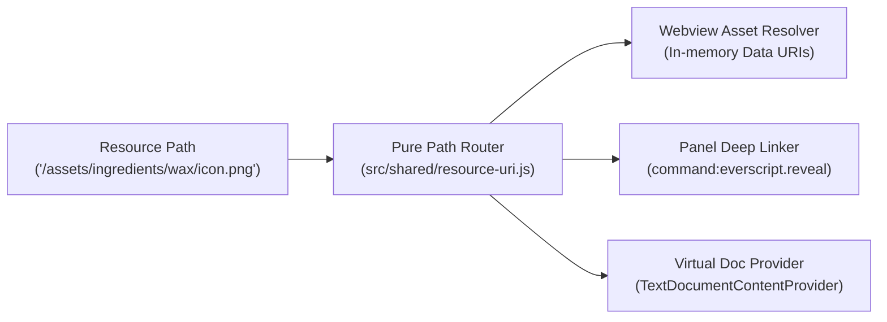

# Resource Addressing & Virtual Asset Paths Specification

> **Status:** Proposal / Design Spec  
> **Goal:** Unified, human-readable URI schema for WRAM addresses, ROM structures, and game assets across VS Code panels, hover tooltips, and webviews.

---

## 1. Motivation

Evermore data is distributed across multiple memory spaces and formats:
- **WRAM:** Dynamic variables (`$2441`), flags (`$2258:0`), entity tables (`$7E1000`).
- **SNES Bus / ROM:** FastROM code (`$928000`), master tables (`$C4601F`), strings (`$11D000`), CHR graphics (`$EE0000`).
- **Assets & Media:** Map headers, triggers, animated sprites, 16×16 item icons, dialogue strings.

Currently, panels and tooltips communicate with disjointed parameters (e.g. `{ roomId: 0x38 }`, `{ address: 0x2258, bit: 0 }`, `renderItemIcon(rom, 0x0120)`). 

A **Uniform Resource Path** allows:
1. Deep-linking between panels (e.g., clicking a memory reference in decompiler jumps directly to that cell in Memory Radar).
2. Human-readable asset paths in webview templates (e.g., ``).
3. Rich hover links and Go-to-Definition in `.evs` scripts.

---

## 2. Resource Path Grammar & Hierarchy

All paths follow a clean, canonical slash hierarchy: `/<domain>/<selector>[<modifier>]`

### 2.1 Memory Domains (`/wram`, `/bus`, `/rom`)

| Path Pattern | Example | Parsed Meaning | Target Subsystem |
|---|---|---|---|
| `/wram/<addr>` | `/wram/2441` | WRAM 16-bit offset in default bank `$7E` | Memory Radar (WRAM grid) |
| `/wram/<addr>[<len>]` | `/wram/2222[2]` | WRAM multi-byte span (2 bytes / word) | Memory Radar (Slice inspector) |
| `/wram/<addr>.<bit>` | `/wram/2258.0` | Persistent story/chest bit flag | Memory Radar (Flags list) |
| `/bus/<24bit-addr>` | `/bus/7e2222`<br>`/bus/928000` | Exact 24-bit SNES CPU bus address | Disassembly / CDL / Hex view |
| `/rom/<offset>` | `/rom/128000` | Exact byte offset in unheadered ROM file | Hex Editor / Binary Inspector |

### 2.2 Asset Domains (`/assets/...`)

| Path Pattern | Example | Description |
|---|---|---|
| `/assets/maps/<id>` | `/assets/maps/38` | Map `0x38` (Prehistoria South Jungle) |
| `/assets/maps/<id>/<subpath>` | `/assets/maps/38/header`<br>`/assets/maps/38/triggers`<br>`/assets/maps/38/collision` | Specific room blob section |
| `/assets/ingredients/<name>` | `/assets/ingredients/wax`<br>`/assets/ingredients/wax/icon.png` | Ingredient metadata or rendered 16×16 icon |
| `/assets/items/<name>/icon.png` | `/assets/items/gladiator_sword/icon.png` | Weapon, armor, or consumable icon |
| `/assets/animations/<id>[<frame>]` | `/assets/animations/boy_attack[0]` | Animation script and frame index |
| `/assets/strings/<id>` | `/assets/strings/0540` | In-game text from the 3,002 table at `$11D000` |
| `/assets/tiles/<tileId>` | `/assets/tiles/0124` | 16×16 CHR graphic tile from `$EE0000` |

---

## 3. Architecture: Why a Virtual Path Router, NOT a Full VFS

> **Superseded:** this section is replaced by [`soe-filesystem-spec.md`](soe-filesystem-spec.md): a read-only `FileSystemProvider` for `soe:`, implemented in `src/resources/`.

### The VFS Anti-Pattern in VS Code
Implementing a full `vscode.FileSystemProvider` (Virtual File System) was considered and rejected:
1. **Webview Sandbox Boundary:** A webview runs in an isolated browser iframe. Browser `` tags cannot resolve custom VS Code VFS protocols due to Content Security Policy (CSP).
2. **Impedance Mismatch:** Memory cells, string tables, and ROM blobs do not have file system semantics (`readdir`, `mtime`, file locks, open handles).
3. **Law 2.5 Compliance (`AI_ARCHITECTURE_GUIDE.md`):** Avoids heavy abstraction layers and registries.

### The Lightweight Solution
Instead of a VFS, the architecture consists of three small, decoupled layers:



#### 1. Pure Path Router (`src/shared/resource-uri.js`, ~60 LOC)
A pure, synchronous function parsing paths into typed descriptors:
```typescript
interface ResourceRoute {
    scheme: 'soeres';
    domain: 'wram' | 'bus' | 'rom' | 'maps' | 'ingredients' | 'animations' | 'strings';
    id: string | number;
    subpath?: string;
    length?: number;
    bit?: number;
    frame?: number;
}

export function parseResourceUri(uri: string): ResourceRoute;
export function formatResourceUri(route: ResourceRoute): string;
```

#### 2. Webview Asset Resolution (`` Tags)
For clean HTML authoring such as ``:
- At build/render time, the webview template runner replaces `/assets/.../icon.png` with the in-memory **PNG Data URI** generated by `src/maps/item-icons.ts` and cached in `src/rooms/data/item-icons.js`.
- Result: Instant rendering, zero disk I/O, zero CSP issues.

#### 3. Cross-Panel Deep Linking (`command:everscript.reveal`)
Allows any panel or markdown tooltip to link anywhere:
```markdown
[Open $2258:0 in Memory Radar](command:everscript.reveal?%22%2Fwram%2F2258.0%22)
[View Map 0x38 in Map Editor](command:everscript.reveal?%22%2Fassets%2Fmaps%2F38%22)
```

#### 4. Optional Read-Only Document Provider
If a user wants to open an inspection tab in VS Code editor, `vscode.workspace.registerTextDocumentContentProvider` provides read-only markdown/JSON/disassembly views for `soeres:/...` URIs in ~40 LOC without any VFS filesystem hooks.

---

## 4. Integration with Existing Domains

| Existing Domain | Integration Point |
|---|---|
| `src/localizations/` | Resolves names, string indices, and table offsets for `/assets/...` and `/bus/...` |
| `src/script/names.json` | Symbol mappings for RAM addresses and loot rewards |
| `src/maps/item-icons.ts` | Pixel generator for `/assets/ingredients/.../icon.png` |
| `src/memory/` | Receiver for `/wram/...` navigation events |
| `src/rooms/` | Receiver for `/assets/maps/...` navigation events |

---

## 5. Implementation Roadmap

1. **Phase 1: URI Parser & Formatter (`src/shared/resource-uri.js`)**
   - Unit tests covering `/wram/`, `/bus/`, `/rom/`, and `/assets/`.
2. **Phase 2: HTML Template Asset Preprocessor**
   - Support `` in webview renders.
3. **Phase 3: Deep Link Command Handler**
   - Implement `everscript.reveal` dispatcher routing to Memory Radar or Map Editor tabs.

