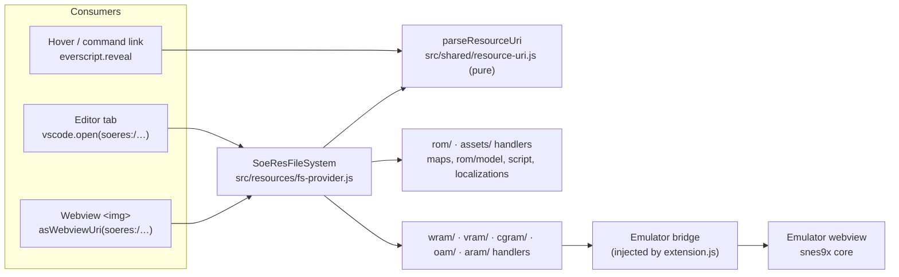

# `soeres:` Read-Only File System Specification

> **Status:** Proposal / Design Spec
> **Builds on:** [`resource-paths-and-assets-spec.md`](resource-paths-and-assets-spec.md) (path grammar, router)
> **Replaces:** §3 of that spec ("VFS rejected") and its `TextDocumentContentProvider` (§3.4)
> **Goal:** One read-only `vscode.FileSystemProvider` for the `soeres:` scheme. It serves ROM content, decoded assets and live emulator memory as files, so editor tabs, webview `` tags, hovers and command links share one kind of address.

---

## 1. Why a file system after all

`resource-paths-and-assets-spec.md` §3 rejected a VFS for two reasons. Neither holds for a read-only provider:

| Concern in §3 | Reality |
|---|---|
| "Webview `` cannot resolve custom VFS schemes (CSP)" | Webviews load local resources through VS Code's file service, which includes extension-registered providers. `webview.asWebviewUri(soeres:/…)` gives an `https://soeres+.vscode-resource.vscode-cdn.net/…` URL. The CSP needs `img-src ${webview.cspSource}`. **To verify with a spike (§8, Phase 1).** |
| "Memory has no file-system semantics" | Only `stat` and `readFile` do work. No `readdir` tree is needed for correctness, and writes throw. "Bytes at this address, in this representation" fits memory and assets well. |
| "Heavy abstraction (Law 2.5)" | About 40 lines of provider plus one handler per top-level directory. It replaces both the data-URI preprocessor and the `TextDocumentContentProvider`, because a content provider cannot serve binary files to webviews. |

What it buys:

- **One address everywhere:** `soeres:/assets/strings/0540` works in an editor tab (`vscode.open`), a webview (`asWebviewUri`) and a command link (`everscript.reveal`).
- **Language features for free:** `soeres:/assets/scripts/17cd.evs` opens with Everscript highlighting and hovers, and `.asm` / `.json` / `.md` get their built-in editors.
- **Lazy and cacheable:** nothing is rendered until something reads it.

`` still does not load by itself. The host or the webview script replaces the `soeres:/` prefix with `String(webview.asWebviewUri(Uri.parse('soeres:/')))`. This is a fixed-prefix substitution, not a path guess.

---

## 2. Rules

1. **Read-only.** Register with `{ isReadonly: true, isCaseSensitive: true }`. `writeFile`, `delete`, `rename` and `createDirectory` throw `FileSystemError.NoPermissions`.
2. **The extension chooses the representation.** The same resource can be served as several files:

   | Extension | Content | Opens as |
   |---|---|---|
   | `.bin` | raw bytes, exactly as in ROM or memory | hex editor (if installed) |
   | `.json` | decoded structure, machine-readable | JSON editor, also used by panels |
   | `.md` | human summary with links to sibling files | Markdown preview |
   | `.png` | rendered graphic | image preview, `` |
   | `.evs` / `.asm` | decompiled script / disassembly | Everscript / 65816 highlighting |
   | `.txt` | decoded text (strings) | plain text |
   | `.spc` | SPC700 snapshot | external player (download) |

3. **Ids are canonical, names are aliases.** Directories are named by lowercase hex id without `$` (`maps/38`, `strings/0540`). Name slugs from `src/localizations/` and `names.json` (`ingredients/wax`) are also accepted on read and resolve to the same handler. Names are subjective and may be renamed, but ids never change, so links written by code use ids.
4. **Slices are readable but not listed.** `rom/c4601f[20].bin` or `wram/2222[2].bin` resolve on read. `readDirectory` lists only the named files below, so the Explorer stays browsable.
5. **Static vs live.**
   - `rom/`, `assets/`: these are pure functions of the ROM bytes. `mtime` is the time the ROM was loaded. They never change until another ROM is loaded, which fires `onDidChangeFile` for the whole tree.
   - `wram/`, `vram/`, `aram/` and the other live directories: this is a snapshot taken at read time from the running emulator. `mtime` is the emulator frame counter. While a live file is watched and the emulator runs, the provider fires `onDidChangeFile` at most 4×/s. While paused it fires none (see the overheating note in the emulator gotchas). Without an emulator, reads throw `FileSystemError.Unavailable`.
   - Webviews add `?f=<frame>` to live image URLs as a cache-buster. The provider ignores the query.
6. **Which ROM.** By default the provider serves the *active* ROM: the one loaded in the emulator, or else the vanilla ROM from `rom-history`. An authority could select a ROM explicitly (`soeres://vanilla/…`, `soeres://build/…`). See §9.

---

## 3. Tree overview

```
soeres:/
├── rom/        static   whole ROM, banks, header, ROM map, disassembly
├── assets/     static   decoded content: maps, items, strings, scripts, graphics, audio
├── wram/       live     128 KB work RAM + names, flags, script slots, entities
├── vram/       live     64 KB video RAM, rendered CHR sheets and BG layers
├── cgram/      live     palettes
├── oam/        live     sprite table
└── aram/       live     64 KB SPC700 audio RAM, DSP registers, .spc snapshot
```

Priorities used below: **P1** = first implementation, **P2** = next, **P3** = later or once the data source exists.
"Source" names the existing module that already computes the content. The provider only routes to it.

---

## 4. `rom/`: the cartridge as bytes

| Path | Content | Source | Prio |
|---|---|---|---|
| `rom/rom.sfc` | whole unheadered ROM | active ROM buffer | P1 |
| `rom/header.json` | title, map mode, sizes, checksum, vectors | `emulator/snes-rom-header-model.js` | P1 |
| `rom/map.md` | ROM map: every region with label, size, world | `rom/model/catalog.js`, `assets.js`, `audio.js` (= ROM tab) | P1 |
| `rom/regions.json` | same regions, machine-readable | `rom/model/*` | P1 |
| `rom/banks/<bb>.bin` | one 64 KB bank (`c0`…`ff`) | ROM buffer | P2 |
| `rom/banks/<bb>.asm` | disassembly using CDL code/data marks, table and function names | `emulator/cdl/disasm.js`, `localizations/functions.js`, `tables.js` | P2 |
| `rom/<offset>[<len>].bin` | arbitrary slice (unlisted) | ROM buffer | P1 |
| `rom/cdl.json` | coverage per bank (code / data / unseen) | CDL library | P3 |

`/bus/<24-bit>` from the path grammar is **not a directory**. The router maps it to `rom/…` (ROM banks) or `wram/…` (`$7E`/`$7F`, low-RAM mirrors), so a bus address always lands on one canonical file.

---

## 5. `assets/`: decoded game content

| Path | Content | Source | Prio |
|---|---|---|---|
| **Maps** | | | |
| `assets/maps/index.json` | room id → name, area, size | `localizations/maps.js` | P1 |
| `assets/maps/<id>/info.md` | summary: size, families, objects, scripts, links | `maps/room.ts` | P1 |
| `assets/maps/<id>/header.json` | room header | `maps/room.ts` (`decodeRoom`) | P1 |
| `assets/maps/<id>/render.png` | full room picture | `maps/render.ts` | P1 |
| `assets/maps/<id>/collision.png` | collision overlay | `maps/collision-overlay.ts` | P2 |
| `assets/maps/<id>/objects.json` / `triggers.json` | object and trigger lists | `maps/objects.ts`, `rooms/parsing` | P2 |
| `assets/maps/<id>/scripts.evs` | the room's scripts, decompiled | `script/room-scripts.ts` | P2 |
| `assets/maps/<id>/blob.bin` | raw room blob | `maps/blob-layout.ts` | P2 |
| **Items** | | | |
| `assets/items/<id>/icon.png` | 16×16 ring-menu icon (`$CE8000` table, ids step by 2) | `maps/item-icons.ts` | **P1** |
| `assets/items/<id>/info.json` | category, index, palette, reward id, name | `item-icons.ts`, `names.json` `lootRewards` | P1 |
| `assets/ingredients/<slug>/…`, `assets/alchemy/<slug>/…` | aliases into `items/` for those categories (`ingredients/wax/icon.png`) | `lootIconId`, `alchemyIconId` | P1 |
| **Text** | | | |
| `assets/strings/<idx>.txt` | one decoded string (3,002-entry table `$11D000`) | `localizations/strings.js` | P1 |
| `assets/strings/all.json` | index → text for every string | `localizations/strings.js` | P2 |
| **Scripts** | | | |
| `assets/scripts/<id>.evs` | decompiled script (NPC/short ids, ABS by bus address, global) | `script/decoder.ts`, `localizations/scripts.js` | P2 |
| **Graphics** | | | |
| `assets/tiles/<id>.png` / `.bin` | `$EE` table graphic (6,688 entries) | `maps/chr.ts`, `rom/model/assets.js` | P2 |
| `assets/palettes/<addr>.png` / `.json` | ROM palette as a swatch strip / colour list | `maps/palette.ts` | P2 |
| `assets/sprites/<id>/sheet.png`, `frames/<n>.png`, `info.json` | sprite frames | `sprites/frame-compose.js`, `maps/sprites.ts` | P2 |
| `assets/animations/<id>/script.txt` | disassembled animation bytecode | `maps/animation-opcodes.ts` | P2 |
| `assets/animations/<id>/frames/<n>.png` | rendered frames | `sprites/animation-decoder.js` | P3 |
| **Characters** | | | |
| `assets/characters/<id>.json` | enemy/character record: name, stats, palettes, boxes | `maps/characters.ts`, `names.json` `enemies` | P2 |
| **Audio** | | | |
| `assets/audio/music/index.json` / `sfx/index.json` | id → title, package | `localizations/sounds.js`, `rom/model/audio.js` | P2 |
| `assets/audio/music/<id>/package.bin` | the package uploaded for that track (music M → package M+1) | `rom/model/audio.js` | P3 |
| `assets/audio/music/<id>.spc` | playable rip | needs a JS port of `../everscript/tools/dump_spc.py` | P3 |

---

## 6. `wram/`: work RAM, names and live values

The emulator runs inside the emulator webview, so the host has no direct access to its memory. The provider asks it through an **emulator bridge**: a request/reply message pair that `extension.js` injects, as it already does for the CDL library. Whole-RAM reads use one `_saveState()` (WRAM at state offset `0x10c14` in the vanilla core). Small reads use `readMemoryRange`, which is capped at 4 KB per call, in the custom core.

Static annotations (names, flag labels) are served even without an emulator. The values in them are then `null`.

| Path | Content | Source | Prio |
|---|---|---|---|
| `wram/wram.bin` | full 128 KB snapshot | bridge | P1 |
| `wram/<addr>[<len>].bin` | slice (unlisted) | bridge | P1 |
| `wram/<addr>.json` | `{ value, size, name, lifecycle, enumLabel }` for one variable, e.g. `wram/2441.json` | bridge + `names.json` `ram`/`ramValues` + CDL `wram-export.js` | P1 |
| `wram/<addr>.<bit>.json` | one flag bit, e.g. `wram/2258.0.json` | bridge + `names.json` `flags` | P1 |
| `wram/symbols.json` | every named address with size and description | `names.json`, `emulator/cdl/wram-export.js` | P1 |
| `wram/flags.json` / `flags.md` | all 842 named flags with their current bit | bridge + `names.json` | P1 |
| `wram/scripts.json` | running script slots (`$7E28FC` slots, run list `$7E2F28`, current instruction `$82`) | bridge + `script-debug-host.js` | P2 |
| `wram/entities/<ptr>.json` | decoded entity (Boy `$4E89`, Dog `$4F37`, …): position, animation, palette | bridge + `map-entities` layout | P2 |
| `wram/party.json` | HP, stats, levels, money, inventory | bridge + `wram-memory-mapping` skill tables | P2 |
| `wram/room.json` | current room, camera, BG scroll, room effect | bridge (`$0ADB`, `$0112`, `$010E`, `$241F`) | P2 |
| `wram/cgram-mirror.bin` | engine CGRAM mirror `$7E6187` (512 B) | bridge | P3 |

---

## 7. `vram/`, `cgram/`, `oam/`, `aram/`: hardware memory

| Path | Content | Source | Prio |
|---|---|---|---|
| `vram/vram.bin` | 64 KB VRAM | save state offset `0xc14` (vanilla core) | P2 |
| `vram/chr/bg.png`, `vram/chr/obj.png` | CHR as a 16×N tile sheet in the current palettes | `vram.bin` + CGRAM, `maps/chr.ts` decoder | P2 |
| `vram/bg1.png`, `vram/bg2.png` | tilemap layers (BG1 canopy at `0x0000`, BG2 terrain at `0x0800`, 32×32 rings of metatile words) | `vram.bin`, room metatiles | P3 |
| `cgram/cgram.bin` | 512 B CGRAM, exactly what the frame renders | custom core `_getPpuView()`, or state offset `0xC8` (vanilla) | P2 |
| `cgram/palettes.png` | 16×16 swatch grid | `cgram.bin` | P2 |
| `cgram/ppu.json` | INIDISP, TM, TS, CGWSEL, CGADSUB | `_getPpuView()` | P3 |
| `oam/oam.bin` / `oam.json` | 544 B OAM, decoded per sprite | state offset `0x902` (vanilla) | P3 |
| `aram/aram.bin` | 64 KB SPC700 RAM | **missing**: offset in the save state not yet located; a `_getAramPtr` export in the custom core would be cleaner | P3 |
| `aram/layout.json` | driver, base bank, package, samples, echo buffer (`$D400-$FBFF` at EDL 5), the unused `$2400-$3ABF` | `rom/model/audio.js` + SPC dumping notes | P3 |
| `aram/dsp.json` | the 128 DSP registers, decoded per voice (8 voices) + globals | **missing**, same as `aram.bin` | P3 |
| `aram/state.spc` | live `.spc` snapshot (ARAM + DSP + SPC700 registers) | needs both of the above | P3 |
| `aram/coverage.json` | which ARAM pages the SPC700 executed or read | CDL ARAM map (`_cdlAramPtr`, 16 × 4 KB) | P3 |

Offsets above were verified on the **vanilla** core. The custom (debugger) core's save-state layout must be checked before reusing them. Otherwise read through `readMemoryRange` / `_getPpuView`, which do not depend on that layout.

---

## 8. Architecture and roadmap



- **New domain `src/resources/`:** `fs-provider.js` (the only file using the VS Code API) and one handler per top-level directory (`rom.js`, `assets.js`, `wram.js`, `hardware.js`). It may depend on `shared/`, `maps/`, `rom/`, `script/`, `localizations/` and `sprites/`. It must **not** depend on `emulator/`: the live bridge is injected by `extension.js`, as the CDL library is injected into `rom/`. Add the rule to `.depcruise.js`.
- **Router:** `src/shared/resource-uri.js` stays pure, with no VS Code API, as specified in the resource-paths spec. The provider and `everscript.reveal` both use it.
- **Cache:** static files are memoised per ROM hash and cleared when the ROM changes. Live files are never cached.

**Phases**

1. **Spike (one afternoon).** Build the provider with only `assets/items/<id>/icon.png`, then show the wax icon in one panel through `asWebviewUri`. This decides whether webviews really load from the provider. If they do not, fall back to data URIs for webviews and keep the provider for editor tabs.
2. **P1 static.** `rom/` (whole, header, map, slices), `assets/` maps (`info.md`, `header.json`, `render.png`), items, strings. Add `soeres:/` prefix substitution to the shared webview helper.
3. **P1 live.** Emulator bridge plus `wram/` (`wram.bin`, per-address JSON, flags, symbols), with throttled change events.
4. **P2.** Scripts as `.evs`, tiles, sprites, characters, VRAM/CGRAM, script slots, entities.
5. **P3.** OAM, ARAM (after a core export), audio packages, `.spc`.

---

## 9. Open questions

1. **ROM selection:** active ROM only, or an authority (`soeres://vanilla/`, `soeres://build/`) so the patched build and the vanilla ROM can be compared side by side?
2. **Workspace folder:** should "Add `soeres:/` to workspace" be offered? Explorer browsing works with `readDirectory`, but Quick Open and Search over virtual files need proposed APIs (`FileSearchProvider`, `TextSearchProvider`) that a published extension cannot use.
3. **Hover images:** whether hover Markdown renders `` is untested. Command links in hovers work regardless.
4. **Writes:** writing `wram/<addr>.bin` as a memory poke is tempting. It stays out of scope; if wanted, it goes behind an explicit setting and the debugger's write path, not the file system.
5. **Slug source:** use `names.json` `lootRewards` (`WAX` → `wax`) or the in-game strings? In-game strings are localised and may contain spaces or symbols, so `names.json` is the safer source.
